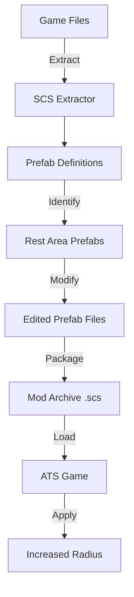

# Design Document: ATS Rest Area Radius Mod

## Overview

This design document outlines the technical approach for creating a mod that increases the activation radius of rest areas in American Truck Simulator. The mod will work by extracting and modifying prefab definition files that control rest area trigger zones, then packaging these modifications into a loadable mod format.

### Key Design Decisions

1. **Prefab-Based Approach**: Rest areas in ATS are implemented as prefabs with trigger zones. Modifying the prefab definitions allows global changes without editing individual map instances.

2. **Definition File Modification**: The activation radius is controlled by parameters in `.sii` or `.pmd` files within prefab definitions. We'll modify these files directly rather than using the map editor for individual instances.

3. **Mod Packaging**: The mod will use the standard `.scs` archive format with proper folder structure to override vanilla game files.

4. **Compatibility Strategy**: The mod will target vanilla ATS and common DLC maps, with a structure that allows easy updates when game versions change.

## Architecture

### Component Overview



### File Structure

```
ATS_Rest_Area_Mod/
├── def/
│   └── world/
│       └── prefab/
│           └── [modified prefab .sii files]
├── prefab/
│   └── [modified prefab .pmd/.ppd files if needed]
├── manifest.sii
└── mod_icon.jpg (optional)
```

## Components and Interfaces

### 1. Extraction Component

**Purpose**: Extract game files to access prefab definitions

**Tools Required**:
- SCS Extractor (official tool from SCS Software)
- 7-Zip or WinRAR for handling archives

**Process**:
1. Locate ATS installation directory (typically `C:\Program Files (x86)\Steam\steamapps\common\American Truck Simulator\`)
2. Identify core archive files:
   - `base.scs` - Core game data
   - `def.scs` - Definition files
   - `core_map.scs` - Map data
3. Extract relevant directories:
   - `/def/world/prefab/` - Prefab definitions
   - `/prefab/` - Prefab model data (if needed)

**Key Files to Extract**:
- Rest area prefab definitions (typically named with patterns like `rest_area_*.sii`, `parking_*.sii`, or `service_*.sii`)
- Trigger zone definitions within prefab files

### 2. Identification Component

**Purpose**: Locate and identify rest area prefabs and their radius parameters

**Search Strategy**:
1. Search for files containing keywords:
   - "rest"
   - "sleep"
   - "parking"
   - "trigger"
2. Look for trigger definitions with radius or range parameters
3. Identify prefab types used across different map regions

**Expected File Format** (`.sii` example):
```
trigger_def : trigger.rest_area {
    trigger_type: sphere
    radius: 15.0
    activation_distance: 15.0
    # other parameters...
}
```

**Parameters to Identify**:
- `radius`: The trigger sphere radius
- `activation_distance`: Distance at which UI prompts appear
- `trigger_type`: Should be sphere or cylinder for rest areas
- `trigger_action`: Should reference rest/sleep functionality

### 3. Modification Component

**Purpose**: Edit prefab files to increase activation radius

**Editing Approach**:
- Use text editor (VS Code, Notepad++, or similar)
- Modify `.sii` definition files directly
- Preserve file encoding (UTF-8 without BOM)
- Maintain proper SII syntax

**Modification Strategy**:

**Default Values** (estimated based on typical game design):
- Current radius: ~10-15 meters
- Recommended increase: 25-30 meters (2x increase)
- Maximum safe value: 50 meters (to avoid overlap issues)

**Parameters to Modify**:
```
# Original
radius: 15.0
activation_distance: 15.0

# Modified (2x increase)
radius: 30.0
activation_distance: 30.0
```

**Validation Rules**:
- Radius must be positive float value
- Activation distance should match or be slightly less than radius
- Maintain consistent units (meters)
- Preserve all other prefab properties

### 4. Packaging Component

**Purpose**: Create a loadable mod archive

**Mod Structure**:
```
ATS_Rest_Area_Mod/
├── def/
│   └── world/
│       └── prefab/
│           ├── rest_area_01.sii
│           ├── rest_area_02.sii
│           └── [other modified files]
├── manifest.sii
└── mod_icon.jpg
```

**Manifest File** (`manifest.sii`):
```
SiiNunit
{
mod_package : .package_name
{
    package_version: "1.0"
    display_name: "Increased Rest Area Radius"
    author: "YourName"
    category[]: "map"
    icon: "mod_icon.jpg"
    description: "Increases the activation radius of rest areas for easier access."
    
    compatible_versions[]: "1.50.*"
}
}
```

**Archive Creation**:
1. Use 7-Zip to create ZIP archive
2. Rename `.zip` to `.scs`
3. Ensure no compression or use store mode (some sources suggest this, but modern ATS supports compression)
4. Place in ATS mod folder: `Documents\American Truck Simulator\mod\`

### 5. Testing Component

**Purpose**: Verify mod functionality in-game

**Test Locations**:
- Any rest area on I-5 in California (vanilla map)
- Rest stops along I-80 (common route)
- Truck stops in starting cities (Bakersfield, Las Vegas, etc.)

**Test Procedure**:
1. Enable mod in mod manager
2. Start new game or load existing save
3. Drive to known rest area
4. Observe activation distance from different angles
5. Verify rest/sleep UI appears at increased distance

**Success Criteria**:
- Rest prompt appears at ~2x the original distance
- No errors in game.log.txt
- Mod shows as active in mod manager
- All rest areas show increased radius (spot check multiple locations)

## Data Models

### Prefab Definition Structure

```
prefab_definition {
    prefab_name: string
    prefab_model: reference
    
    trigger_zones: array {
        trigger_def {
            trigger_type: enum [sphere, box, cylinder]
            radius: float (meters)
            activation_distance: float (meters)
            trigger_action: reference
            position: vector3
            rotation: quaternion
        }
    }
    
    spawn_points: array {...}
    connections: array {...}
}
```

### Mod Package Structure

```
mod_package {
    package_version: string
    display_name: string
    author: string
    category: array[string]
    icon: string (path)
    description: string
    compatible_versions: array[string]
}
```

## Error Handling

### Extraction Errors

**Issue**: Cannot extract game files
**Causes**:
- Game not installed
- Insufficient permissions
- Corrupted archive files

**Solutions**:
- Verify game installation via Steam
- Run extractor as administrator
- Verify game file integrity through Steam

### Modification Errors

**Issue**: Syntax errors in modified files
**Causes**:
- Incorrect SII syntax
- Wrong encoding
- Missing brackets or semicolons

**Solutions**:
- Use syntax-aware text editor
- Validate file encoding (UTF-8)
- Compare with original file structure
- Use SII file validators if available

### Packaging Errors

**Issue**: Mod doesn't load in game
**Causes**:
- Incorrect folder structure
- Wrong file paths
- Missing manifest
- Incompatible version

**Solutions**:
- Verify folder structure matches vanilla paths exactly
- Check manifest.sii syntax
- Ensure compatible_versions includes current game version
- Check game.log.txt for specific errors

### Runtime Errors

**Issue**: Mod loads but radius unchanged
**Causes**:
- Wrong prefab files modified
- Mod load order issues
- Cache not cleared

**Solutions**:
- Verify correct prefab files were identified
- Ensure mod has high priority in mod manager
- Clear game cache (delete cache folder in Documents)
- Test with only this mod enabled

## Testing Strategy

### Unit Testing (File Validation)

1. **Syntax Validation**
   - Verify all modified .sii files have valid syntax
   - Check for matching brackets and proper formatting
   - Validate float values are properly formatted

2. **Structure Validation**
   - Confirm folder structure matches vanilla paths
   - Verify manifest.sii is properly formatted
   - Check file encoding is correct

### Integration Testing (Mod Loading)

1. **Mod Manager Test**
   - Mod appears in mod manager
   - No errors shown in mod manager
   - Mod can be enabled/disabled

2. **Game Loading Test**
   - Game starts with mod enabled
   - No crashes during loading
   - game.log.txt shows no errors related to mod

### Functional Testing (In-Game)

1. **Radius Verification**
   - Test at multiple rest areas
   - Approach from different angles
   - Measure approximate activation distance
   - Compare with unmodded game (disable mod and retest)

2. **Compatibility Testing**
   - Test on vanilla map
   - Test with common DLC maps (if owned)
   - Test with other common mods enabled
   - Verify no conflicts or crashes

### Regression Testing

1. **Game Update Testing**
   - After ATS updates, verify mod still loads
   - Check if prefab structure changed
   - Update compatible_versions if needed

## Implementation Notes

### Tool Setup Details

**SCS Extractor**:
- Download from SCS Software forum or official sources
- No installation required (portable executable)
- Point to ATS installation directory
- Extract to temporary working directory

**Text Editor Recommendations**:
- VS Code with SII syntax highlighting (if extension available)
- Notepad++ with custom syntax highlighting
- Any editor that supports UTF-8 encoding

**Archive Tool**:
- 7-Zip (free, open source)
- WinRAR (commercial)
- Built-in Windows ZIP (may work but less reliable)

### File Path Conventions

ATS uses Unix-style paths even on Windows:
- Use forward slashes: `/def/world/prefab/`
- Paths are case-sensitive in some contexts
- Maintain exact vanilla path structure in mod

### Version Compatibility

**Version String Format**: `"1.XX.*"`
- Example: `"1.50.*"` for version 1.50.x
- Wildcard allows minor version updates
- Update when major game version changes

### Best Practices

1. **Backup Original Files**: Keep extracted vanilla files for reference
2. **Incremental Changes**: Start with small radius increase, test, then adjust
3. **Documentation**: Comment changes in files for future reference
4. **Version Control**: Keep different versions of mod for different radius values
5. **Naming Convention**: Use descriptive mod names indicating radius multiplier

### Potential Limitations

1. **Map-Specific Prefabs**: Some DLC maps may use unique prefabs not covered by base game modifications
2. **Trigger Overlap**: Very large radii may cause overlapping triggers in dense areas
3. **Performance**: Extremely large trigger zones may impact performance (unlikely at 2-3x increase)
4. **Multiplayer**: Mod may not work in multiplayer or may cause desync issues

### Future Extensions

1. **Configurable Radius**: Create multiple mod versions (1.5x, 2x, 3x)
2. **Selective Modification**: Different radii for different rest area types
3. **UI Indicators**: Add visual indicators for trigger zones (advanced)
4. **DLC Support**: Specific versions for each DLC map
5. **Compatibility Patches**: Patches for popular map mods

## Technical Research Notes

### ATS Modding Ecosystem

- **Official Support**: SCS Software provides modding tools and documentation
- **Community Resources**: Active modding community with forums and tutorials
- **File Formats**: Proprietary but text-based and well-documented
- **Mod Distribution**: Steam Workshop and third-party sites

### Prefab System

- Prefabs are reusable templates instantiated across maps
- Modifying prefab definition affects all instances
- Prefabs can have multiple trigger zones
- Trigger zones can have different shapes (sphere, box, cylinder)

### Trigger System

- Triggers detect player/vehicle presence
- Activation distance controls UI prompt appearance
- Trigger actions reference game functions (rest, sleep, refuel, etc.)
- Multiple triggers can exist in single prefab

### Mod Loading System

- Mods loaded in priority order (user-configurable)
- Later mods override earlier mods
- Mod files override vanilla files if paths match
- Manifest required for mod recognition

## Conclusion

This design provides a comprehensive approach to creating an ATS rest area radius mod through prefab modification. The solution is maintainable, extensible, and follows ATS modding best practices. The key insight is that rest areas use prefab-based trigger zones, allowing global changes through definition file modification rather than per-instance map editing.
